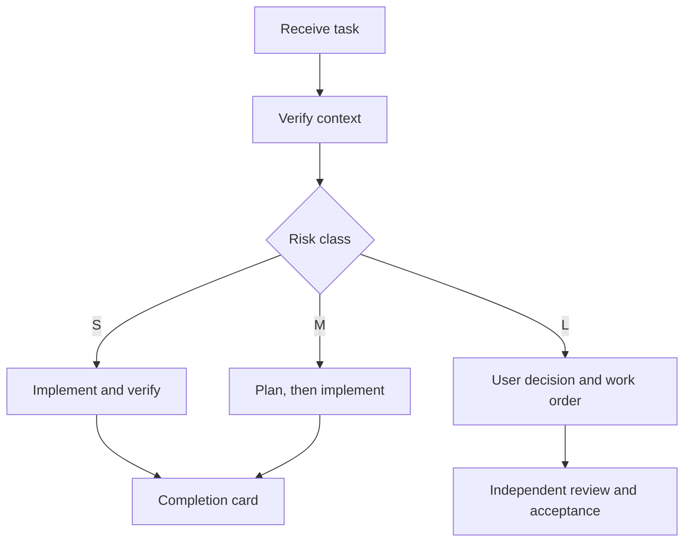

# Universal Agent Workflow Starter

**English** | [简体中文](./README.md)

[](./PROMPT.en.md)
[](./LICENSE)
[](./PROMPT.en.md)

> One universal prompt that makes any AI agent understand the task, control scope, and leave reviewable evidence before claiming completion.

It works with Codex, ChatGPT, Claude, Gemini, and other agents across software development, data work, research, automation, and documentation.

## Why Use It?

| Common agent behavior | With this workflow |
| --- | --- |
| Starts changing things before reading the context | Confirms inputs, objective, and actual state first |
| Expands scope silently during discussion | Declares allowed, prohibited, and user-decision items |
| Mixes planning, execution, and acceptance | Separates PLANNER, EXECUTOR, REVIEWER, and ACCEPTOR |
| Reports only “done” | Reports changes, verification results, and remaining risk |
| Requests approval repeatedly for small tasks | Selects an S / M / L path based on risk |

## Start in 30 Seconds

1. Open the [complete English prompt](./PROMPT.en.md).
2. Copy the entire file into your agent.
3. Submit your task. The agent selects its role, risk class, and execution path automatically.

You can also use the [complete Chinese prompt](./PROMPT.zh-CN.md) or open the [English examples](./EXAMPLES.en.md).

## Workflow



## Five Roles

| Role | When to use it | Primary responsibility |
| --- | --- | --- |
| `SOLO` | One agent handles a low-risk task end to end | Research, plan, execute, verify |
| `PLANNER` | A complex task needs a decision or plan first | Research, compare options, produce a work order |
| `EXECUTOR` | A clear task or approved work order exists | Implement, test, record evidence |
| `REVIEWER` | An existing result needs independent inspection | Review read-only by default and report findings |
| `ACCEPTOR` | A formal pass/fail decision is required | Accept against frozen criteria and independent evidence |

## Simplest Launch Message

```text
Follow the Universal Agent Workflow with the role set to SOLO.
Task: [your task]
Known inputs: [files, links, repository, or materials]
Constraints: [budget, time, and prohibited actions]
Start with a concise Task Kickoff Card, then proceed according
to the task's risk class.
```

For a multi-agent setup:

```text
GPT Pro / any planning model = PLANNER
Codex / any execution agent = EXECUTOR
A separate new session = REVIEWER
```

See [English examples](./EXAMPLES.en.md) for more copy-ready templates.

## Repository Contents

| File | Contents |
| --- | --- |
| [`PROMPT.en.md`](./PROMPT.en.md) | Complete English master prompt |
| [`PROMPT.zh-CN.md`](./PROMPT.zh-CN.md) | Complete Chinese master prompt |
| [`EXAMPLES.en.md`](./EXAMPLES.en.md) | English single-agent and multi-agent examples |
| [`EXAMPLES.zh-CN.md`](./EXAMPLES.zh-CN.md) | Chinese single-agent and multi-agent examples |
| [`LICENSE`](./LICENSE) | CC BY 4.0 license |

## Design Principles

- separate facts from proposals;
- execute only within approved scope;
- separate implementation from acceptance;
- preserve an end-to-end evidence trail;
- move quickly on small tasks and control high-risk work strictly.

## Author and License

Created by **ray**, version **V1.0**, released **2026-08-18**.

Licensed under [CC BY 4.0](https://creativecommons.org/licenses/by/4.0/). You may copy, adapt, translate, and use this work commercially or non-commercially, provided that you give appropriate credit to `ray` and indicate whether changes were made.
