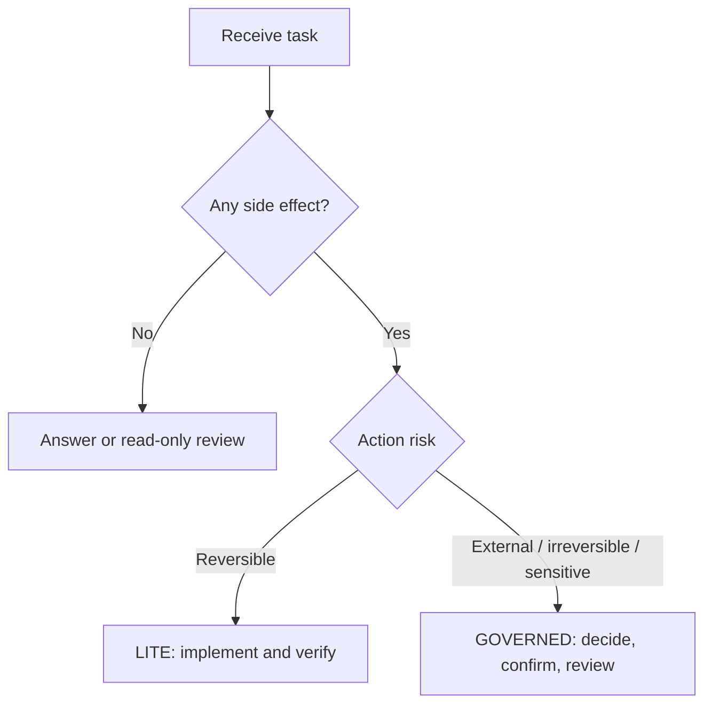

# Universal Agent Workflow Starter

**English** | [简体中文](./README.md)

[](./CHANGELOG.md)
[](./LICENSE)
[](./CORE.en.md)

> A capability-aware workflow for AI agents: lightweight on simple tasks, strict around risky actions, and explicit about evidence and completion boundaries.

It is designed for most instruction-following AI agents. File access, tools, project instructions, Skills, and independent sessions depend on the host and are not granted by this prompt.

## Choose an Entry Point

| Use case | Recommended entry | Behavior |
| --- | --- | --- |
| Q&A, research, ordinary editing, small development, reversible work | [LITE English](./PROMPT.lite.en.md) | Recommended default; short and direct |
| Publication, deletion, production, privacy, payment, multi-agent work, formal work orders, or acceptance | [GOVERNED English](./PROMPT.governed.en.md) | Full authorization, evidence, and handoff controls |
| Understand the shared design | [CORE English](./CORE.en.md) | Stable rules; not required in every prompt |

Chinese entry points: [LITE](./PROMPT.lite.zh-CN.md) · [GOVERNED](./PROMPT.governed.zh-CN.md) · [CORE](./CORE.zh-CN.md)

## Start in 30 Seconds

1. For ordinary work, open [LITE English](./PROMPT.lite.en.md).
2. Copy the complete file into the agent or its custom-instruction entry point.
3. Describe the task, inputs, and constraints. You do not need to assign a role or memorize stage names.

Minimum launch message:

```text
Task: [what you want completed]
Inputs: [files, links, repository, or materials]
Constraints: [prohibited actions, budget, time, and data boundaries]
```

## What V1.1 Fixes

- separates task complexity `S / M / L` from action risk;
- separates single/multi-agent orchestration from the current duty;
- fixes unreachable ACCEPT behavior and the ambiguity between self-review and acceptance;
- no longer treats a bare “Yes” as general high-risk authorization;
- adds just-in-time confirmation, baseline drift, and approval expiry;
- adds prompt-injection, secret, privacy, and fallback-tool boundaries;
- separates evidence, decision, and execution states;
- requires multiple options only when a real tradeoff exists;
- gives simple tasks a three-line kickoff instead of a full form.

## Workflow Selection



Complexity controls planning depth. Action risk controls authorization. A one-line task may be high risk, while a large read-only study may need no approval.

## Duties Are Not Agent Counts

V1.1 uses two independent concepts:

- orchestration: `SOLO / SEQUENTIAL / PARALLEL`;
- current duty: `ADVISE / PLAN / EXECUTE / REVIEW / ACCEPT`.

One agent may perform several duties in sequence. Use a separate actor only when independence matters, or state that the review is not independent. Final `USER_ACCEPTED` status can come only from the user unless the user explicitly delegates formal acceptance authority.

## Platform Adapters

- [Adapter guide](./adapters/README.en.md)
- [Codex AGENTS.md template](./adapters/codex/AGENTS.md)
- [Codex / ChatGPT Skill](./adapters/codex-skill/universal-agent-workflow/SKILL.md)

`AGENTS.md` is a Codex-supported project-instruction entry point, not an automatic-discovery guarantee for every agent. The Skill uses progressive loading so the full GOVERNED prompt does not occupy every context.

## Examples and Regression Tests

- [English examples](./EXAMPLES.en.md)
- [Minimum behavioral evals](./EVALS.en.md)

The evals cover unnecessary approval, ambiguous authorization, publication, prompt injection, secret handling, baseline drift, self-acceptance, missing tools, and parallel ownership.

## Repository Contents

| File | Contents |
| --- | --- |
| [`CORE.en.md`](./CORE.en.md) / [`CORE.zh-CN.md`](./CORE.zh-CN.md) | Stable core rules |
| [`PROMPT.lite.*`](./PROMPT.lite.en.md) | Default lightweight prompt |
| [`PROMPT.governed.*`](./PROMPT.governed.en.md) | High-risk governed prompt |
| [`adapters/`](./adapters/) | Generic, Codex, and Skill entry points |
| [`EVALS.en.md`](./EVALS.en.md) | Behavioral regression suite |
| [`EXAMPLES.en.md`](./EXAMPLES.en.md) / [`EXAMPLES.zh-CN.md`](./EXAMPLES.zh-CN.md) | Multi-domain launch examples |
| [`CHANGELOG.md`](./CHANGELOG.md) | Version history |

## V1.0 Compatibility

The original V1.0 complete prompts remain at [`PROMPT.en.md`](./PROMPT.en.md) and [`PROMPT.zh-CN.md`](./PROMPT.zh-CN.md), so existing links remain valid. New users should start with LITE and switch to GOVERNED for high-risk work.

## Limitations

This is a behavioral protocol, not a permission system. It cannot guarantee full model compliance or replace CI, backups, audits, security controls, and human judgment. “Cross-agent” describes portable design, not verified support on every platform; record real results in [EVALS](./EVALS.en.md).

## Author and License

Created by **ray**. V1.1 candidate published **2026-08-18**.

Licensed under [CC BY 4.0](https://creativecommons.org/licenses/by/4.0/). Recommended attribution:

```text
Based on Universal Agent Workflow Starter by ray,
licensed under CC BY 4.0. Changes were made.
https://github.com/Ray111351/universal-agent-workflow-starter
```

Found a problem? [Open an issue](https://github.com/Ray111351/universal-agent-workflow-starter/issues) and include the agent, model, workflow version, task, expected behavior, and actual behavior.
