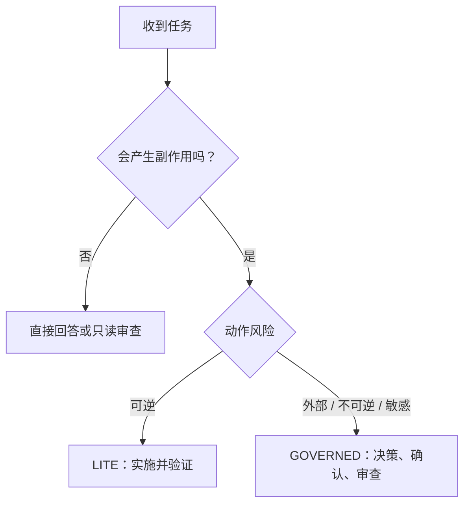

# Universal Agent Workflow Starter

**简体中文** | [English](./README.en.md)

[](./CHANGELOG.md)
[](./LICENSE)
[](./CORE.zh-CN.md)

> 一套能力感知的通用 Agent 工作流：简单任务少走流程，高风险动作严格控制，所有完成声明都有边界和证据。

它适用于多数能够遵循指令的 AI Agent。文件、工具、项目指令、Skill 和独立会话等能力取决于具体宿主，不由这份提示词授予。

## 先选一个入口

| 使用场景 | 推荐入口 | 特点 |
| --- | --- | --- |
| 问答、研究、普通改写、小型开发、可逆任务 | [LITE 中文版](./PROMPT.lite.zh-CN.md) | 默认推荐，短而直接 |
| 发布、删除、生产、隐私、付费、多 Agent、正式工作单或验收 | [GOVERNED 中文版](./PROMPT.governed.zh-CN.md) | 完整授权、证据与交接控制 |
| 了解两种模式共同遵循的设计 | [CORE 中文版](./CORE.zh-CN.md) | 稳定规则，不必每次复制 |

英文入口：[LITE](./PROMPT.lite.en.md) · [GOVERNED](./PROMPT.governed.en.md) · [CORE](./CORE.en.md)

## 30 秒开始

1. 普通任务打开 [LITE 中文版](./PROMPT.lite.zh-CN.md)。
2. 复制全文，粘贴到 Agent 或自定义指令入口。
3. 直接描述任务、输入和限制；无需手动指定角色或记住阶段名。

最小调用消息：

```text
任务：[你想完成什么]
输入：[文件、链接、仓库或资料]
限制：[不能做什么、预算、时间、数据边界]
```

## V1.1 修复了什么

- 将任务复杂度 `S / M / L` 与动作风险彻底拆开；
- 将单 Agent、多 Agent 编排与当前职责拆开；
- 修复 ACCEPT 无法自动到达和“自审等于验收”的歧义；
- 不再把单独的“可以 / Yes”当作高风险通用授权；
- 增加执行前即时确认、基线漂移和授权过期；
- 增加提示注入、密钥、隐私和工具替代边界；
- 将事实、决策和执行状态分为三组；
- 只有存在真实取舍时才要求比较多个方案；
- 为简单任务提供三行启动信息，而不是完整表格。

## 工作流选择



复杂度决定计划深度；动作风险决定授权。一个任务只改一行也可能是高风险，一个大型只读研究也可能不需要审批。

## 角色不等于 Agent 数量

V1.1 使用两个独立概念：

- 编排：`SOLO / SEQUENTIAL / PARALLEL`；
- 当前职责：`ADVISE / PLAN / EXECUTE / REVIEW / ACCEPT`。

一个 Agent 可以按阶段依次承担多个职责。只有需要独立审查时才应使用不同主体或明确说明并不独立；最终 `USER_ACCEPTED` 只能来自用户，除非用户明确委托其他正式验收权。

## 平台适配器

- [适配器说明](./adapters/README.md)
- [Codex AGENTS.md 模板](./adapters/codex/AGENTS.md)
- [Codex / ChatGPT Skill](./adapters/codex-skill/universal-agent-workflow/SKILL.md)

`AGENTS.md` 是 Codex 支持的项目指令入口，并不保证所有 Agent 都会自动读取。Skill 适合渐进加载，减少完整版提示词长期占用上下文。

## 示例与回归测试

- [中文实战示例](./EXAMPLES.zh-CN.md)
- [最小行为 Evals](./EVALS.md)

Evals 覆盖不过度审批、模糊授权、公开发布、提示注入、秘密保护、基线漂移、自我验收、工具不足和并行所有权等场景。

## 仓库内容

| 文件 | 内容 |
| --- | --- |
| [`CORE.zh-CN.md`](./CORE.zh-CN.md) / [`CORE.en.md`](./CORE.en.md) | 稳定核心规则 |
| [`PROMPT.lite.*`](./PROMPT.lite.zh-CN.md) | 默认轻量提示词 |
| [`PROMPT.governed.*`](./PROMPT.governed.zh-CN.md) | 高风险治理提示词 |
| [`adapters/`](./adapters/) | 通用、Codex 与 Skill 入口 |
| [`EVALS.md`](./EVALS.md) | 行为回归测试 |
| [`EXAMPLES.zh-CN.md`](./EXAMPLES.zh-CN.md) / [`EXAMPLES.en.md`](./EXAMPLES.en.md) | 多领域调用示例 |
| [`CHANGELOG.md`](./CHANGELOG.md) | 版本变化 |

## V1.0 兼容

原始 V1.0 完整提示词继续保留在 [`PROMPT.zh-CN.md`](./PROMPT.zh-CN.md) 和 [`PROMPT.en.md`](./PROMPT.en.md)，现有链接不会失效。新用户默认从 LITE 开始，高风险任务再切换 GOVERNED。

## 限制

这是一套行为协议，不是权限系统。它不能保证所有模型完全遵守，也不能代替 CI、备份、审计、安全控制和人工判断。“跨 Agent”表示设计可移植，不表示每个平台已通过实测；请在 [EVALS](./EVALS.md) 中记录实际结果。

## 作者与许可

由 **ray** 创建。V1.1.0 发布于 **2026-08-18**。

采用 [CC BY 4.0](https://creativecommons.org/licenses/by/4.0/) 许可。推荐署名：

```text
Based on Universal Agent Workflow Starter by ray,
licensed under CC BY 4.0. Changes were made.
https://github.com/Ray111351/universal-agent-workflow-starter
```

发现问题请[提交 Issue](https://github.com/Ray111351/universal-agent-workflow-starter/issues)，并注明 Agent、模型、工作流版本、任务、期望行为和实际行为。
