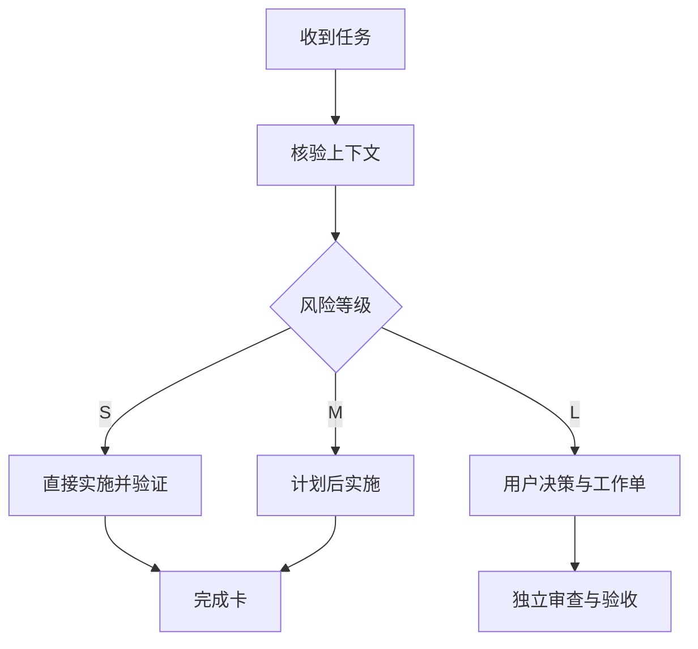

# Universal Agent Workflow Starter

**简体中文** | [English](./README.en.md)

[](./PROMPT.zh-CN.md)
[](./LICENSE)
[](./PROMPT.zh-CN.md)

> 用一段通用提示词，让任何 AI Agent 在动手前先理解任务、控制范围，并在完成后留下可复核证据。

它适用于 Codex、ChatGPT、Claude、Gemini 及其他 Agent，也适用于软件开发、数据处理、研究、自动化和文档项目。

## 为什么需要它

| 常见 Agent 工作方式 | 使用本工作流后 |
| --- | --- |
| 没读完资料就开始修改 | 先确认输入、目标和真实状态 |
| 讨论中悄悄扩大范围 | 明确允许、禁止和需用户决定的事项 |
| 计划、实施和验收混在一起 | 分离 PLANNER、EXECUTOR、REVIEWER、ACCEPTOR |
| 只说“已经完成” | 报告实际变更、验证结果和剩余风险 |
| 小任务也反复请求批准 | 按 S / M / L 风险自动选择流程 |

## 30 秒开始

1. 打开[完整中文提示词](./PROMPT.zh-CN.md)。
2. 复制全文，粘贴到你正在使用的 Agent。
3. 直接提交任务；Agent 会自动选择角色、风险等级和执行路径。

也可以使用[完整英文提示词](./PROMPT.en.md)或查看[中文示例](./EXAMPLES.zh-CN.md)。

## 工作流程



## 五种角色

| 角色 | 适用情况 | 主要职责 |
| --- | --- | --- |
| `SOLO` | 一个 Agent 端到端处理低风险任务 | 研究、计划、执行、验证 |
| `PLANNER` | 复杂任务需要先形成方案 | 调研、比较方案、生成工作单 |
| `EXECUTOR` | 已有明确任务或获批工作单 | 实施、测试、留证 |
| `REVIEWER` | 需要独立检查已有结果 | 默认只读审查并报告发现 |
| `ACCEPTOR` | 需要正式判断是否通过 | 对照冻结标准和独立证据验收 |

## 最简单的调用方式

```text
请按照 Universal Agent Workflow 工作，角色设为 SOLO。
任务是：[你的任务]
已知输入：[文件、链接、仓库或资料]
限制：[预算、时间、禁止事项]
请先给简短任务启动卡，然后按风险等级推进。
```

如果你使用多个 Agent：

```text
GPT Pro / 任意规划模型 = PLANNER
Codex / 任意执行 Agent = EXECUTOR
新的独立会话 = REVIEWER
```

更多可复制模板见[中文实战示例](./EXAMPLES.zh-CN.md)。

## 仓库内容

| 文件 | 内容 |
| --- | --- |
| [`PROMPT.zh-CN.md`](./PROMPT.zh-CN.md) | 完整中文总控提示词 |
| [`PROMPT.en.md`](./PROMPT.en.md) | 完整英文总控提示词 |
| [`EXAMPLES.zh-CN.md`](./EXAMPLES.zh-CN.md) | 中文单 Agent 与多 Agent 示例 |
| [`EXAMPLES.en.md`](./EXAMPLES.en.md) | 英文单 Agent 与多 Agent 示例 |
| [`LICENSE`](./LICENSE) | CC BY 4.0 许可 |

## 设计原则

- 事实与建议分层；
- 只在批准范围内执行；
- 实现与验收分离；
- 保留端到端证据；
- 小任务快速推进，高风险任务严格控制。

## 作者与许可

由 **ray** 创建，版本 **V1.0**，发布日期 **2026-08-18**。

本项目采用 [CC BY 4.0](https://creativecommons.org/licenses/by/4.0/) 许可。你可以复制、修改、翻译和用于商业或非商业项目，但必须合理署名 `ray` 并说明是否进行了修改。
